# python_labs
## Лаба №1
### Задание 1
```python
name = input("Имя: ")
age = int(input("Возраст: "))
print(f"Привет, {name}! Через год тебе будет {age+1}.")
```
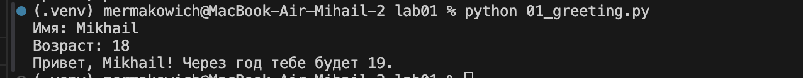

### Задание 2
```python
a = float(input("a: "))
b = float(input("b: "))
print(f"sum={a+b:.2f}; avg={(a+b)/2:.2f}")
```
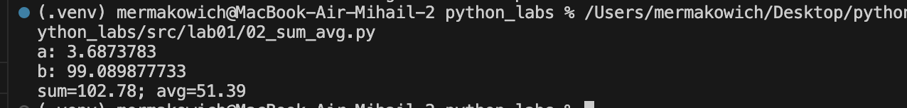

### Задание 3
```python
price, discount, vat = map(float, input("Введите price (руб.), discount (%), vat (%) через запятую: ").split(","))
base = price * (1 - discount/100)
vat_amount = base * (vat/100)
total = base + vat_amount
print(f"База после скидки: {base:.2f} ₽")
print(f"НДС:               {vat_amount:.2f} ₽")
print(f"Итого к оплате:    {total:.2f} ₽")
```
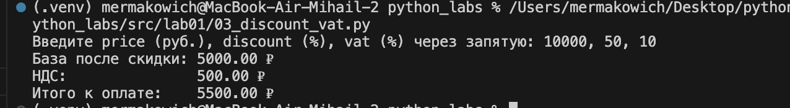

### Задание 4
```python
m = int(input("Минуты: "))
hours = m // 60
minutes = m % 60
print(f"{hours}:{minutes:02d}")
```
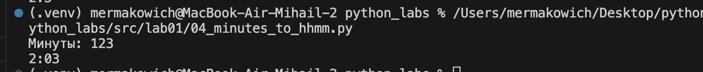

### Задание 5
```python
m = list(input("ФИО: ").split())
print(f"Инициалы: {m[0][0]+m[1][0]+m[2][0]}.")
print(f"Длина (символов): {len(m[0])+len(m[1])+len(m[2]) + 2}")
```
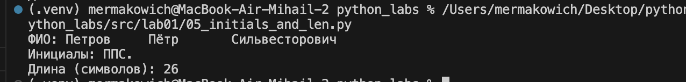

## Лаба №3
### Задание А - text.py

1. Функция normalize. Возвращает нормализованную строку.
```python
def normalize(text: str, *, casefold: bool = True, yo2e: bool = True) -> str:
    """
    Функция нормализует строку через casefold, меняет все ё/Ë на е/Е и убирает лишние пробелы
    """
    if casefold:
        text = text.casefold()
    if yo2e:
        text = text.replace("ё", "е").replace("Ё", "Е")
    text = " ".join((text.replace("\t", " ").replace("\r", " ").replace("\n", " ")).split())
    return text
```
Исходные данные
- `"ПрИвЕт\nМИр\t"`
- `"ёжик, Ёлка" (yo2e=True) `
- `"Hello\r\nWorld"`
- `"  двойные   пробелы  "`

Выходные данные
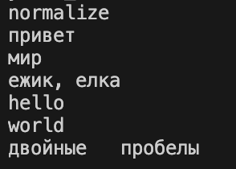

2. Функция tokenize. Возвращает масив токенов по маске.
```python
def tokenize(text: str) -> list[str]:
    """
    Функция разбивает на «слова» по небуквенно-цифровым разделителям, возвращает массив токенов
    """
    tokens = re.findall(r'\w+(?:-\w+)*', text)
    return tokens
```
Исходные данные
- `"привет мир"`
- `"hello,world!!!"`
- `"по-настоящему круто"`
- `"2025 год"`
- `"emoji 😀 не слово"`

Выходные данные
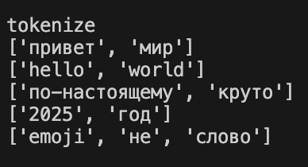

3. Функция count_freq. Возвращает словарь `слово → количество`.
```python
def count_freq(tokens: list[str]) -> dict[str, int]:
    """
    Функция создаёт множество из полученного массива токенов, для каждого элемента множества считает частоту в исходном массиве
    и записывает в словарь
    """
    dict_list = {}
    set_list = set(tokens)
    for token in set_list:
        dict_list[token] = tokens.count(token)
    return dict(sorted(dict_list.items()))
```
Исходные данные
- `["a","b","a","c","b","a"]`
- `["bb","aa","bb","aa","cc"]`

Выходные данные
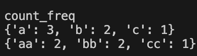

4. Функция top_n. Возвращает массив кортежей топ-N по убыванию частоты, при равенстве - по алфавиту.
```python
def top_n(freq: dict[str, int], n: int = 5) -> list[tuple[str, int]]:
    """
    Функция сортирует items словаря частот и выводит первые N значений
    """
    sorted_items = sorted(freq.items())
    return sorted_items[:n]
```
Исходные данные
- `["a","b","a","c","b","a"], n=2`
- `["bb","aa","bb","aa","cc"], n=2`

Выходные данные
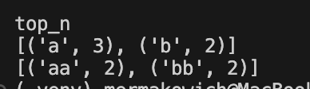

### Задание 2 - text_stats.py

Вводим через `stdin` через команду `sys.stdin.read()`

Далее вызываем команды из text.py

```python
import sys
from text import normalize, tokenize, count_freq, top_n

text = sys.stdin.read()
    
normalized_text = normalize(text)
tokens = tokenize(normalized_text)
freq = count_freq(tokens)

print(f"Всего слов: {len(tokens)}")
print(f"Уникальных слов: {len(freq)}")
print("Топ-5:")
for word, count in top_n(freq, 5):
    print(f"{word}:{count}")
```

Ввод
`$ echo "Привет, мир! Привет!!!" | python src/text_stats.py`

Вывод
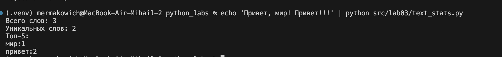


## Лаба №4
### Задание А - модуль src/lab04/io_txt_csv.py

1. Функция `read_text`. Функция читает текст и из файла и возвращает как одну строку. Каждая новая строка склеивается с предыдущей через пробел.  
Если файл не найден, возникает `FileNotFoundError`, функция падает.  
Если кодировка не подходит, возникает `UnicodeDecodeError`, функция падает.  


2. Функция `write_csv`. Функция создаёт или перезаписывает CSV с разделителем ",".  
header (если есть), всегда записывается первой строкой.  
Если `rows` имеют разную длину, то поднимаем `ValueError`  
Если `rows` пустой и `header=None` создаётся пустой CSV  

#### Тест
```python
from io_txt_csv import read_text, write_csv
txt = print(read_text("data/lab04/input1.txt"))  # должен вернуть строку
write_csv([("word","count"),("test",3)], "data/lab04/check.csv")  # создаст CSV
```

input.txt
- `Всем привет! Я сделал лабу!!!`

вывод в консоль
- `Всем, привет! Я сделал лабу!!!`

check.csv
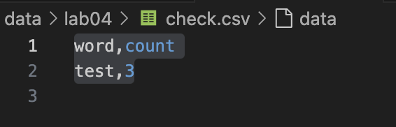


### Задание B - скрипт src/lab04/text_report.py

Скрипт читает входной файл `data/lab04/input.txt`,  
Нормализует, токенизирует и считает частоты слов прочитанного файла,  
Сохраняет `data/lab04/report.csv` c колонками: word,count, отсортированными: count ↓, слово ↑ (при равенстве),  
Выводит в консоль краткое резюме.  
Нужные функции импортируем из `lib/text.py` и `io_text_csv.py` с помощью относительного импорта.  
С помощью библиотеки `parser` читаем команды из командной строки, в том числе указание другой кодировки с помощью --encoding  
Если файла нет или проблема с кодировкой, то выводим print с ошибкой, а затем выходим через `sys.exit(1)`.  
Если `input.txt` пустой, то `report.csv` содержит только заголовок.  

#### Тесты

##### A. Один файл 

Ввод в терминал
`python -m src.lab04.text_report --in data/lab04/input1.txt --out data/lab04/report.csv`

Вход (data/lab04/input1.txt):
`Всем, привет! Я сделал лабу!!!`

report.csv
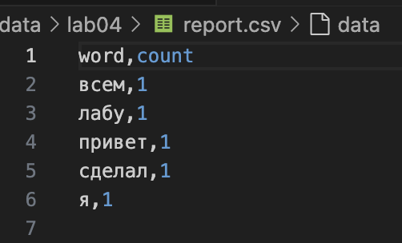

консоль
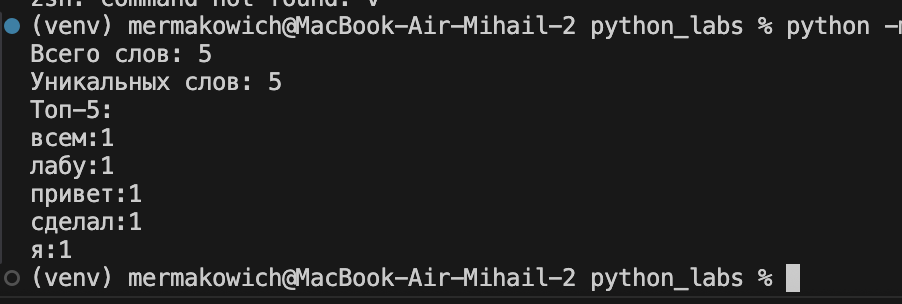

##### B. Пустой файл

Ввод в терминал
`python -m src.lab04.text_report --in data/lab04/input1.txt --out data/lab04/report.csv`

Вход (data/lab04/input1.txt) пустой

report.csv
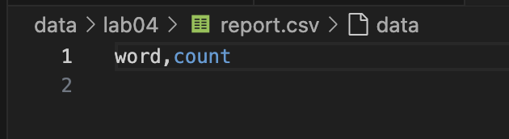

консоль
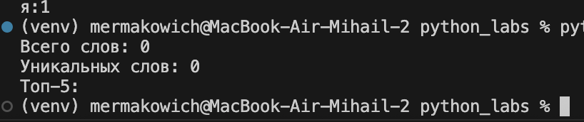

##### C. Кодировка cp1251

Ввод в терминал
`python -m src.lab04.text_report --in data/lab04/input.txt --out data/lab04/report.csv --encoding cp1251`

Вход (data/lab04/input.txt):
`Привет` (кодировка cp1251)

report.csv
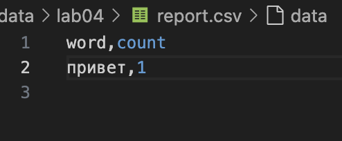

консоль
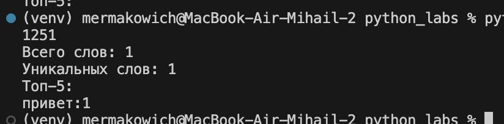

## Лаба №5
### Задание А - модуль src/lab05/json_csv.py

1. Функция `json_to_csv`. Преобразует JSON-файл в CSV.  Заголовки берутся из первого объекта.  
Отсутствующие значения заменяются на пустую строку. Файл записывается в UTF-8.  

Аргументы:  
    `json_path`: путь к входному JSON,  
    `csv_path`: путь к выходному CSV.  

Ошибки:  
    `FileNotFoundError`: если файл отсутствует,  
    `ValueError`: если структура неверная, нет заголовков, не всё словари или файл пустой. 

#### Тест
people.json
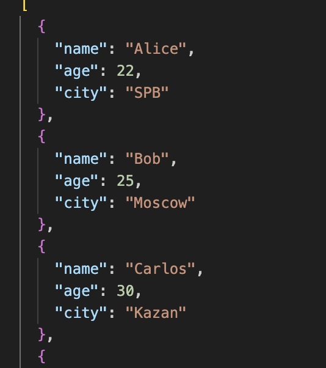

people_from_json.csv
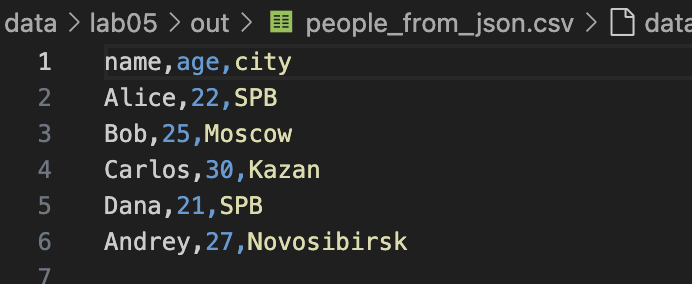


2. Функция `csv_to_json`. Функция преобразует CSV-файл в JSON.
Все значения сохраняются как строки.

#### Тест

people.csv
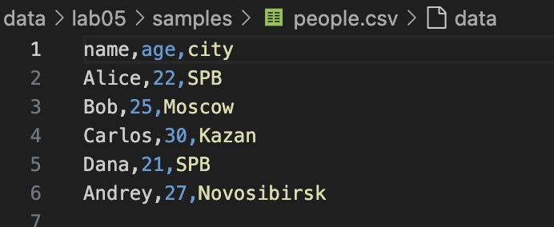

people_from_csv.json
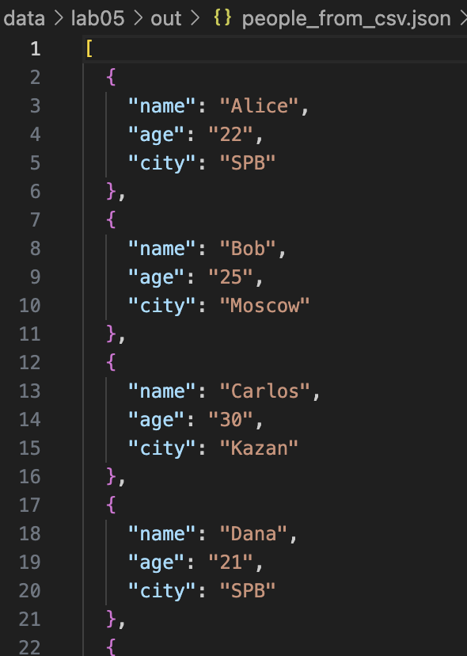


### Задание B - скрипт src/lab04/text_report.py

Конвертирует `CSV` в `XLSX` (лист `"Лист1"`, автоширина >=8),  
Читаем `CSV` через `csv.reader()`,  
Создаем `Workbook`, лист `"Лист1"`,  
Добавляем строки через `ws.append()`,  
Устанавливает ширину колонок, равную `12` через `ws.column_dimensions[].width`

Аргументы:
    `csv_path`: путь к `CSV`, 
    `xlsx_path`: путь к `XLSX`.

Ошибки:
    `FileNotFoundError`: если `CSV` не найден, 
    `ValueError`: если `CSV` пустой.

#### Тесты

people.csv


people_from_csv.xlsx
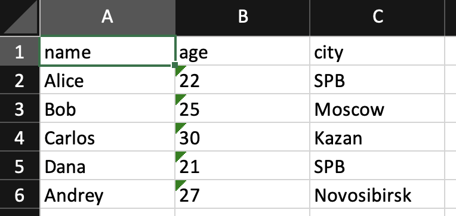


cities.csv
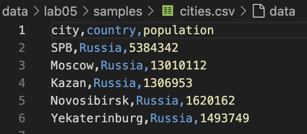

cities_from_csv.xlsx
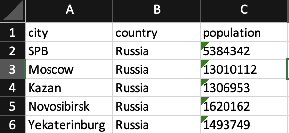


## Лаба №6
### Задание А

- Модуль `src/lab06/cli_text.py` с подкомандами:
  - `stats --input <txt> [--top 5]` — анализ частот слов в тексте (использовать функции из `lab03`);
  - `cat --input <path> [-n]` — вывод содержимого файла построчно (с нумерацией при `-n`).

#### Примеры запуска

text.txt
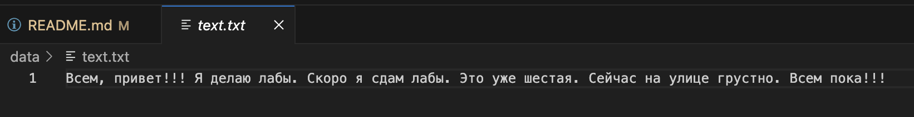

`python -m src.lab06.cli_text stats --input data/text.txt --top 3`
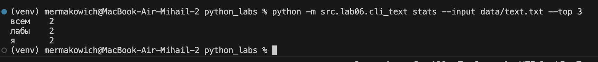

`python -m src.lab06.cli_text cat --input data/text.txt -n`
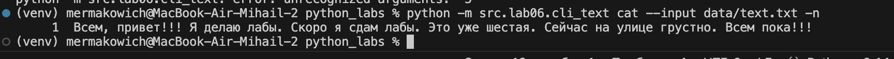

`python -m src.lab06.cli_text --help`
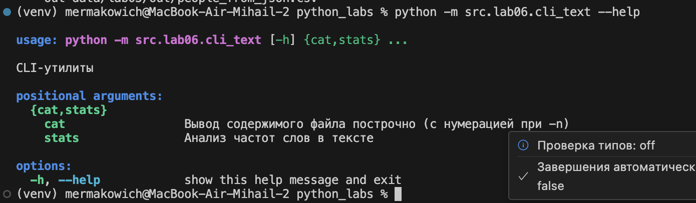


### Задание B

- Модуль `src/lab06/cli_convert.py` с подкомандами:
  - `json2csv --in data/samples/people.json --out data/out/people.csv`  
  - `csv2json --in data/samples/people.csv --out data/out/people.json`  
  - `csv2xlsx --in data/samples/people.csv --out data/out/people.xlsx`  

#### Примеры запуска

`python -m src.lab06.cli_convert json2csv --in data/lab05/samples/people.json  --out data/lab05/out/people_from_json.csv`
- Создаёт people_from_json.csv, точно такой же как в 5 лабе, аналагично для других утилит

`python_labs % python -m src.lab06.cli_convert --help`
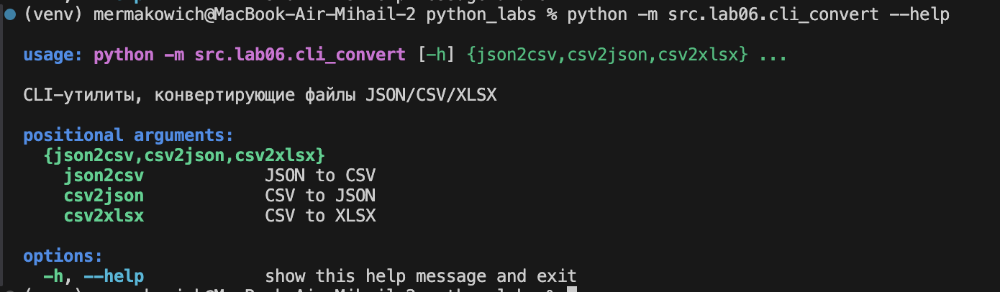

## Лаба №7

### Задание A. Тесты для `src/lib/text.py`

Написаны автотесты для всех публичных функций модуля:

- `normalize(text: str) -> str`
- `tokenize(text: str) -> list[str]`
- `count_freq(tokens: list[str]) -> dict[str, int]`
- `top_n(freq: dict[str, int], n: int) -> list[tuple[str, int]]`

Проверены базовые и граничные случаи, одинаковые частоты слов  
Использован `@pytest.mark.parametrize`

#### Пример запуска теста

`python -m pytest tests/test_text.py`
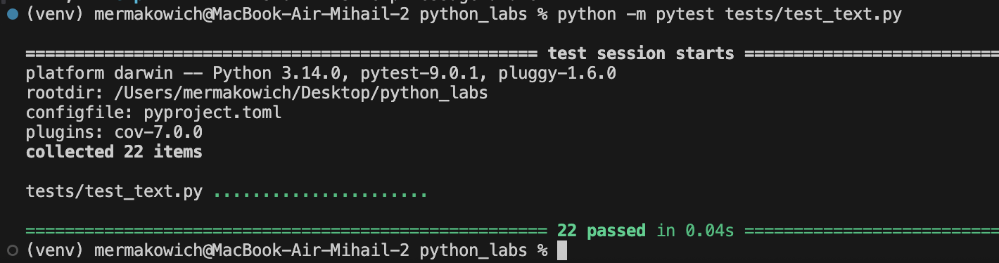


### Задание B. Тесты для `src/lab05/json_csv.py`

Написаны автотесты для функций:
- `json_to_csv(src_path: str, dst_path: str)`
- `csv_to_json(src_path: str, dst_path: str)`

Функции корректно работают, 
- при пустом или некорректном входном файле получаем `ValueError`;
- при несуществующем пути к файлу получаем `FileNotFoundError`.

Использована фикстура `tmp_path` для создания тестовых файлов

#### Пример запуска теста

`python -m pytest tests/test_json_csv.py`
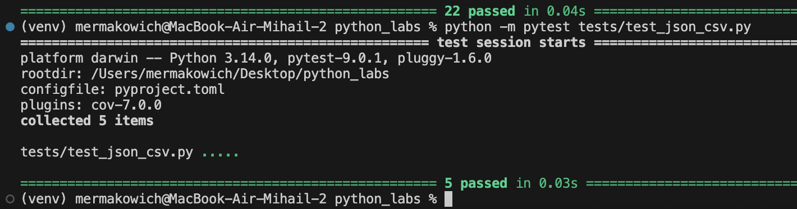


#### Общее покрытие тестами

`pytest --cov=src --cov-report=term-missing`
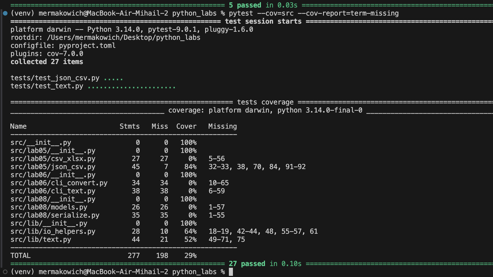

В строке `missing` видим, какие строки кода не покрыты тестами. Все тесты выполняются

### Задание C. Стиль

Отформатировано с помощью `black .`
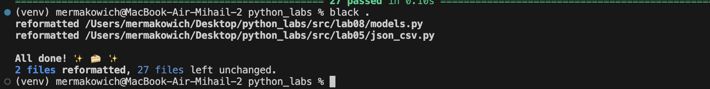


## Лаба №8

### Задание A `src/lab08/models.py`

Создан класс **`Student`**, содержащий:

- декоратор `@dataclass`
- поля:
  - `fio`
  - `birthdate`
  - `group`
  - `gpa`
- методы:
  - `age()`. Высчитывает возраст с помощью библиотеки `datetime`
  - `to_dict()`. Создаёт словарь, готовый для конвертации в JSON-файл
  - `from_dict()`. Используем `@classmethod` для создания нового словаря
  - `__str__()`. Делаем красивый вывод через f-строку
- валидацию в `__post_init__`:
  - формата даты (`YYYY-MM-DD`)
  - диапазона среднего балла `0 ≤ gpa ≤ 5`


### Задание B `serialize.py`

`students_to_json(students, path)`

Сохраняет список студентов в JSON.

`students_from_json(path) -> list[Student]`

-   читает JSON-массив
-   валидирует
-   создаёт список `Student`

#### Пример запуска теста

students_input.json
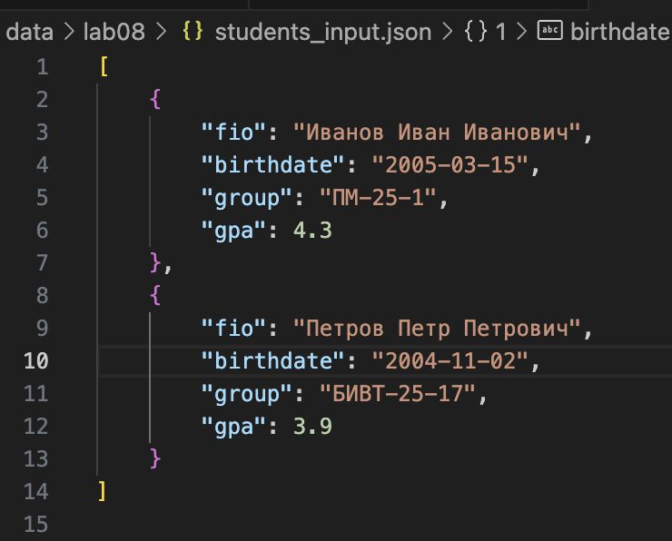

тесты в `serialize.py`
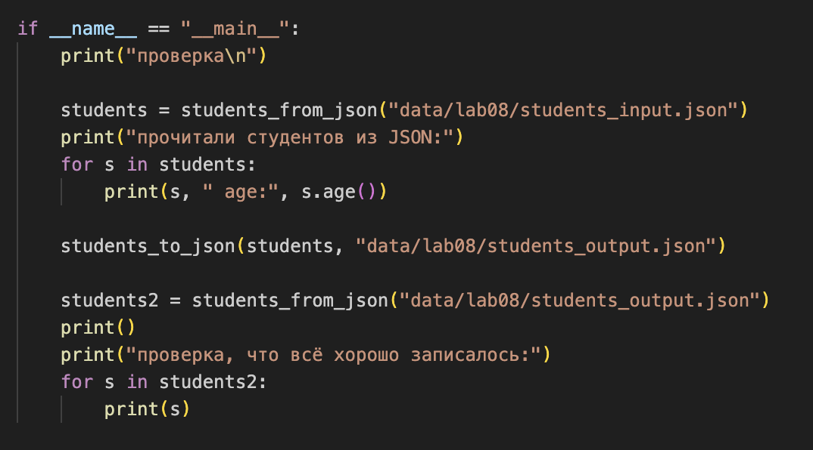

вывод в теримнал
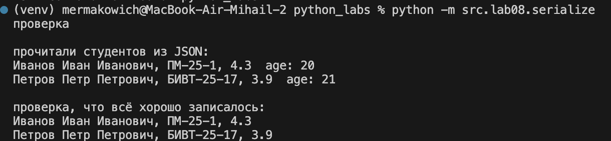

students_output.json
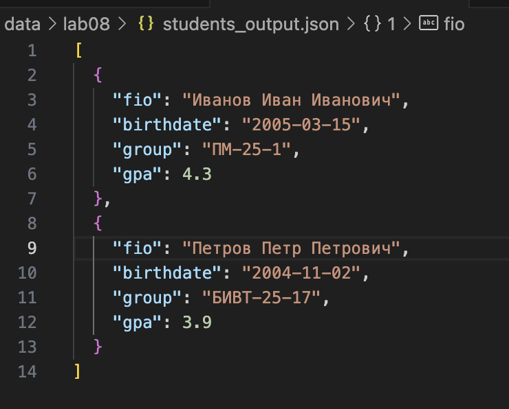


## Лаба №9

### Задание A `src/lab09/group.py`

Создан класс **`Group`**, реализующий CRUD-операции для работы с базой данных студентов в формате CSV:

#### Структура класса

- **Поля:**
  - `path` — путь к CSV-файлу с данными студентов
  - `HEADER` — константа с названиями колонок: `["fio", "birthdate", "group", "gpa"]`

- **Методы инициализации:**
  - `__init__(storage_path)` — создаёт экземпляр группы и инициализирует CSV-файл с заголовком, если файл не существует

#### CRUD-операции

1. **CREATE — `add(student: Student)`**
   - Добавляет нового студента в конец CSV-файла
   - Использует `csv.writer` для записи
   - Автоматически форматирует данные через `student.to_dict()`

2. **READ — `list() -> list[Student]`**
   - Читает все записи из CSV-файла
   - Валидирует каждую строку на соответствие заголовку
   - Возвращает список объектов `Student`
   - Обрабатывает ситуацию, когда файл не существует

3. **READ — `find(substr: str) -> list[Student]`**
   - Ищет студентов по подстроке в ФИО (без учёта регистра)
   - Использует метод `lower()` для регистронезависимого поиска
   - Возвращает список найденных студентов

4. **UPDATE — `update(fio: str, **fields)`**
   - Обновляет поля первого найденного студента по точному совпадению ФИО
   - Принимает именованные аргументы для обновления: `fio`, `birthdate`, `group`, `gpa`
   - Валидирует названия полей через `HEADER`
   - Валидирует данные через `Student.from_dict()` перед сохранением
   - Перезаписывает весь файл с обновлёнными данными используя `write_csv()` из Lab04

5. **DELETE — `remove(fio: str)`**
   - Удаляет первую найденную запись с точным совпадением ФИО
   - Использует чтение всех записей, удаление нужной и перезапись файла
   - Перезапись выполняется через `write_csv()` из Lab04


### Демонстрация работы

Запуск тестирования всех CRUD-операций:

```bash
python -m src.lab09.group
```

#### Результаты выполнения:

1. **READ — вывод всех студентов из базы данных**
   - Отображается список всех 8 студентов с их данными
   - Показывается ФИО, группа и GPA

2. **CREATE — добавление нового студента**
   - Добавлен тестовый студент "Тестов Тест Тестович"
   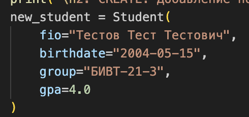
   - База данных увеличилась до 9 студентов
   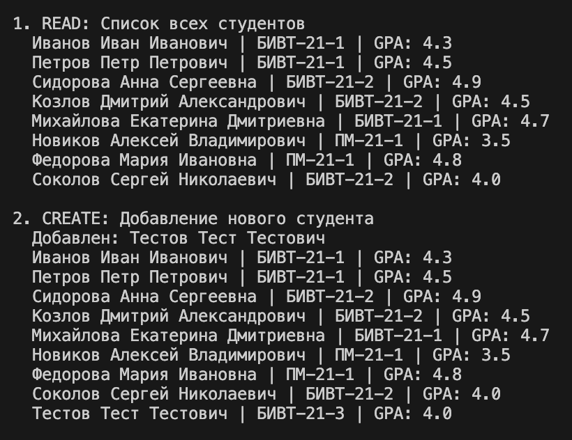


3. **FIND — поиск по подстроке**
   - Поиск по подстроке "Тест" нашёл добавленного студента

4. **UPDATE — обновление данных**
   - GPA студента обновлён с 4.0 на 4.5
   - Изменения сохранены в CSV-файле

5. **DELETE — удаление студента**
   - Удалён тестовый студент
   - База вернулась к исходным 8 студентам
   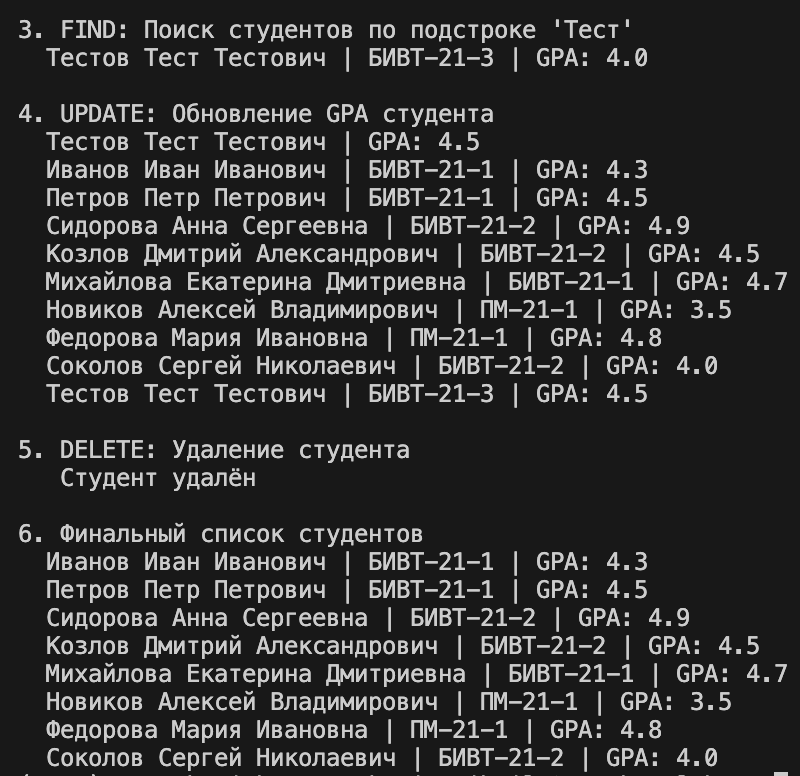

### Файлы данных

**data/lab09/students.csv** — база данных студентов:

```csv
fio,birthdate,group,gpa
Иванов Иван Иванович,2003-10-10,БИВТ-21-1,4.3
Петров Петр Петрович,2004-11-02,БИВТ-21-1,4.5
Сидорова Анна Сергеевна,2003-05-15,БИВТ-21-2,4.9
Козлов Дмитрий Александрович,2004-03-20,БИВТ-21-2,4.5
Михайлова Екатерина Дмитриевна,2003-08-12,БИВТ-21-1,4.7
Новиков Алексей Владимирович,2004-01-25,ПМ-21-1,3.5
Федорова Мария Ивановна,2003-12-08,ПМ-21-1,4.8
Соколов Сергей Николаевич,2004-06-30,БИВТ-21-2,4.0
```
