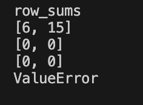

# python_labs
## Лаба №1
### Задание 1
```python
name = input("Имя: ")
age = int(input("Возраст: "))
print(f"Привет, {name}! Через год тебе будет {age+1}.")
```


### Задание 2
```python
a = float(input("a: "))
b = float(input("b: "))
print(f"sum={a+b:.2f}; avg={(a+b)/2:.2f}")
```


### Задание 3
```python
price, discount, vat = map(float, input("Введите price (руб.), discount (%), vat (%) через запятую: ").split(","))
base = price * (1 - discount/100)
vat_amount = base * (vat/100)
total = base + vat_amount
print(f"База после скидки: {base:.2f} ₽")
print(f"НДС:               {vat_amount:.2f} ₽")
print(f"Итого к оплате:    {total:.2f} ₽")
```


### Задание 4
```python
m = int(input("Минуты: "))
hours = m // 60
minutes = m % 60
print(f"{hours}:{minutes:02d}")
```


### Задание 5
```python
m = list(input("ФИО: ").split())
print(f"Инициалы: {m[0][0]+m[1][0]+m[2][0]}.")
print(f"Длина (символов): {len(m[0])+len(m[1])+len(m[2]) + 2}")
```


## Лаба №2
### Задание 1 - arrays.py

1. Функция min_max. Возвращает кортеж (минимум, максимум). Если список пуст — ValueError.
```python
def min_max(nums: list[float or int]) -> tuple[float or int, float or int]:
    """
    Вовзвращаем минимальное и максмальное значение массива
    """
    if not nums:
        return "ValueError"
    return (min(nums), max(nums))
```
Исходные данные
- `[3, -1, 5, 5, 0]`
- `[42]`
- `[-5, -2, -9]`
- `[]`
- `[1.5, 2, 2.0, -3.1]`

Выходные данные


2. Функция unique_sorted. Возвращает отсортированный список уникальных значений (по возрастанию).
```python
def unique_sorted(nums: list[float or int]) -> list[float or int]:
    """
    Возвращаем отсортированный список уникальных значений
    """
    if not nums:
        return []
    return sorted(set(nums))
```
Исходные данные
- `[3, 1, 2, 1, 3]`
- `[]`
- `[-1, -1, 0, 2, 2]`
- `[1.0, 1, 2.5, 2.5, 0]`

Выходные данные


3. Функция flatten. Возвращает «Расплющенный» список списков/кортежей в один список по строкам (row-major).
```python
def flatten(mat: list[list or tuple]) -> list:
    """
    <Плющим> строки списка списков/кортежей в один список
    """
    row_major = []
    for i in range(len(mat)):
        if isinstance(mat[i], list) or isinstance(mat[i], tuple):
            """
            Проверяем элементы (список или кортеж), а потом проходимся по каждому элементу строки
            """
            for k in range(len(mat[i])):
                row_major.append(mat[i][k])
        else:
            return "TypeError"
    return row_major
```
Исходные данные
- `[[1, 2], [3, 4]]`
- `[[1, 2], (3, 4, 5)]`
- `[[1], [], [2, 3]]`
- `[[1, 2], "ab"]`

Выходные данные


### Задание 2 - matrix.py

Все функции для ПРЯМОУГОЛЬНЫХ матриц.
Проверка реализуется функцией ```isrectangle(mat: list[list[float or int]])```
```python
def isrectangle(mat: list[list[float or int]]):
    """
    Функция проверяет прямоугольность НЕПУСТОЙ матрицы
    """
    lenstr = len(mat[0])
    for line in mat:
        if len(line) == lenstr:
            continue
        else:
            return False
    return True
```


1. Функция transpose. Меняет строки и столбцы матрицы местами
```python
def transpose(mat: list[list[float or int]]) -> list[list]:
    """
    Проверка на пустой массив и непрямоугольность
    """
    if mat == []:
        return []
    if not isrectangle(mat):
        return "ValueError"
    """
    Меняет строки и столбцы местами, trans - новый массив
    """
    trans = [[] for k in range(len(mat[0]))]
    for i in range(len(mat)):
        for k in range(len(mat[i])):
            trans[k].append(mat[i][k])
    return trans
```
Исходные данные
- `[[1, 2, 3]]`
- `[[1], [2], [3]]`
- `[[1, 2], [3, 4]]`
- `[]`
- `[[1, 2], [3]]`

Выходные данные


2. Функция row_sums. Возвращает массив с суммами по каждой строке матрицы.
```python
def row_sums(mat: list[list[float or int]]) -> list[float]:
    """
    Проверка на пустой массив и непрямоугольность
    """
    if mat == []:
        return []
    if not isrectangle(mat):
        return "ValueError"
    """
    Заходим в каждую строку и получаем сумму элементов строки, которую помещаем в массив row_sum
    """
    row_sum = []
    for i in range(len(mat)):
        lensum = 0
        for k in range(len(mat[i])):
            lensum += mat[i][k]
        row_sum.append(lensum)
    return row_sum
```
Исходные данные
- `[[1, 2, 3], [4, 5, 6]]`
- `[[-1, 1], [10, -10]]`
- `[[0, 0], [0, 0]]`
- `[[1, 2], [3]]`

Выходные данные


3. Функция col_sums. Возвращает массив с суммами по каждому столбцу матрицы.
```python
def col_sums(mat: list[list[float or int]]) -> list[float]:
    """
    Проверка на пустой массив и непрямоугольность
    """
    if mat == []:
        return []
    if not isrectangle(mat):
        return "ValueError"

    """
    Заходит в каждый столбец и суммирует элементы, сумма помещается в col_sum
    """
    col_sum = []
    for i in range(len(mat[0])):
        lencol = 0
        for k in range(len(mat)):
            lencol += mat[k][i]
        col_sum.append(lencol)
    return col_sum
```
Исходные данные
- `[[1, 2, 3], [4, 5, 6]]`
- `[[-1, 1], [10, -10]]`
- `[[0, 0], [0, 0]]`
- `[[1, 2], [3]]`

Выходные данные


### Задание 3 - tuples.py

Ввод как кортеж:
```
(fio: str, group: str, gpa: float)
```

Реализована функция format_record, возвращает строки вида:
```
Иванов И.И., гр. BIVT-25, GPA 4.60
```

```python
def format_record(rec: tuple[str, str, float]) -> str:
    fio = list(rec[0].split())
    group = rec[1]
    gpa = rec[2]

    if not fio or not group or not isinstance(gpa, float):
        return "TypeError"

    if len(fio) == 3:
        return f"{fio[0].capitalize()} {fio[1][0].upper()}.{fio[2][0].upper()}, гр. {group}, GPA {gpa:.2f}"
    if len(fio) == 2:
        return f"{fio[0].capitalize()} {fio[1][0].upper()}., гр. {group}, GPA {gpa:.2f}"
```

Исходные данные
- `("Иванов Иван Иванович", "BIVT-25", 4.6)`
- `("Петров Пётр", "IKBO-12", 5.0)`
- `("Петров Пётр Петрович", "IKBO-12", 5.0)`
- `("  сидорова  анна   сергеевна ", "ABB-01", 3.999)`

Выходные данные
